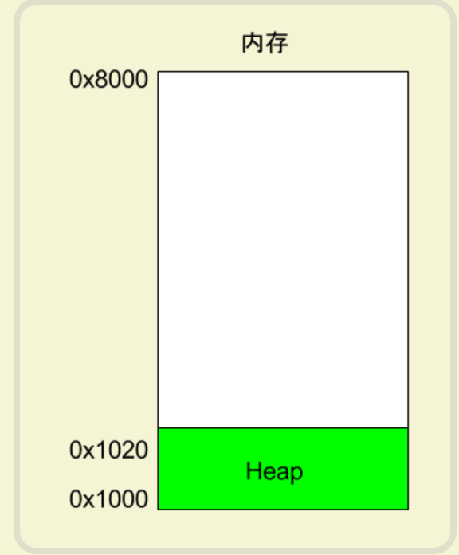
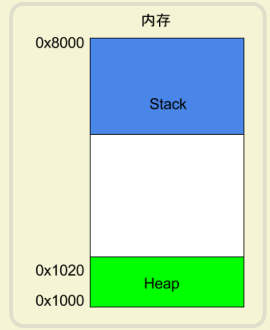
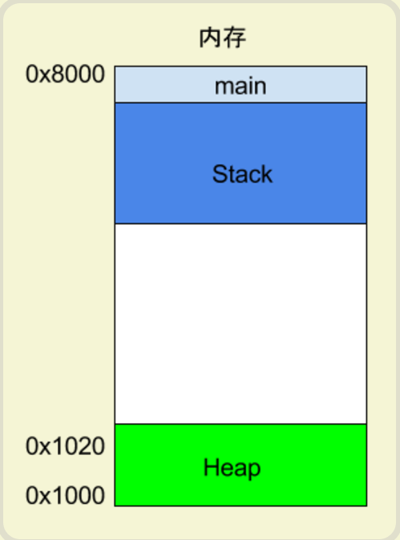
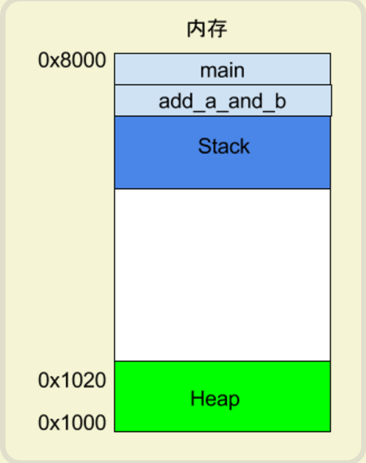
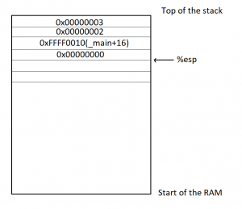

# [1 汇编语言入门教程](https://www.ruanyifeng.com/blog/2018/01/assembly-language-primer.html)


## 1.1 学习目的

为了更好调试bug，看出程序崩溃的原因。


## 1.2 定义

操作计算机的<font color='red'>指令都是二进制</font>的，称为<font color='red'>操作码（opcode）</font>，比如加法指令就是00000011。编译器的作用，就是将高级语言写好的程序，翻译成一条条操作码。

<font color='red'>汇编语言是二进制指令的文本形式</font>，与指令是一一对应的关系。比如，加法指令00000011写成汇编语言就是 ADD。只要还原成二进制，汇编语言就可以被 CPU 直接执行，<font color='red'>所以它是最底层的低级语言。</font>


## 1.3 寄存器

先来看寄存器。<font color='red'>CPU 本身只负责运算，不负责储存数据。</font>数据一般都储存在内存之中，CPU 要用的时候就去<font color='red'>内存</font>读写数据。但是，CPU 的运算速度远高于内存的读写速度，为了避免被拖慢，<font color='red'>CPU 都自带一级缓存和二级缓存</font>。基本上，CPU 缓存可以看作是读写速度较快的内存。

但是，CPU 缓存还是不够快，另外数据在缓存里面的地址是不固定的，CPU 每次读写都要寻址也会拖慢速度。因此，除了缓存之外，CPU 还自带了<font color='red'>寄存器</font>（register），用来储存最常用的数据。也就是说，那些最频繁读写的数据（比如循环变量），都会放在寄存器里面，CPU 优先读写寄存器，再由寄存器跟内存交换数据。

## 1.4 寄存器种类

早期的 <font color='red'>x86 CPU</font> 只有8个寄存器，而且每个都有不同的用途。现在的寄存器已经有<font color='red'>100多个了，都变成通用寄存器，不特别指定用途了</font>，但是早期寄存器的名字都被保存了下来。

> - EAX
> - EBX
> - ECX
> - EDX
> - EDI
> - ESI
> - EBP
> - ESP

我们常常看到 32位 CPU、64位 CPU 这样的名称，其实指的就是寄存器的大小。<font color='red'>32 位 CPU 的寄存器大小就是4个字节。</font>

ESP 寄存器有特定用途，保存当前 Stack 的地址（详见下一节）。


在 x86 架构的汇编语言中，`EAX`、`EBX`、`ECX`、`EDX`、`EDI`、`ESI`、`EBP` 和 `ESP` 是通用寄存器，它们在函数调用、数据处理和程序流程控制中扮演着重要角色。以下是这些寄存器的详细解释：

1. **EAX (Extended Accumulator)**：
   - `EAX` 是累加器寄存器的扩展，用于存储算术和逻辑操作的结果。在 32 位系统中，它是 `AX` 寄存器的扩展，而在 16 位系统中，`AX` 寄存器又被分为两个 8 位寄存器：`AH`（高字节）和 `AL`（低字节）。
2. **EBX (Extended Base)**：
   - `EBX` 是基址寄存器的扩展，用于存储内存地址或用作通用数据存储。在 32 位系统中，它是 `BX` 寄存器的扩展，而在 16 位系统中，`BX` 寄存器又被分为两个 8 位寄存器：`BH`（高字节）和 `BL`（低字节）。
3. **ECX (Extended Counter)**：
   - `ECX` 是计数器寄存器的扩展，常用于循环和字符串操作中的计数。在 32 位系统中，它是 `CX` 寄存器的扩展，而在 16 位系统中，`CX` 寄存器又被分为两个 8 位寄存器：`CH`（高字节）和 `CL`（低字节）。
4. **EDX (Extended Data)**：
   - `EDX` 是数据寄存器的扩展，用于存储I/O操作的数据或作为通用数据存储。在 32 位系统中，它是 `DX` 寄存器的扩展，而在 16 位系统中，`DX` 寄存器又被分为两个 8 位寄存器：`DH`（高字节）和 `DL`（低字节）。
5. **EDI (Extended Destination Index)**：
   - `EDI` 是目标索引寄存器的扩展，用于存储目标地址指针，常用于字符串和数组操作中的目标地址。在 32 位系统中，它是 `DI` 寄存器的扩展。
6. **ESI (Extended Source Index)**：
   - `ESI` 是源索引寄存器的扩展，用于存储源地址指针，常用于字符串和数组操作中的源地址。在 32 位系统中，它是 `SI` 寄存器的扩展。
7. **<font color='red'>EBP (Extended Base Pointer)</font>**：
   - `EBP` 是基指针寄存器的扩展，用于指向当前函数的栈帧基地址，常用于访问函数的局部变量和参数。在 32 位系统中，它是 `BP` 寄存器的扩展。
8. **<font color='red'>ESP (Extended Stack Pointer)</font>**：
   - `ESP` 是栈指针寄存器的扩展，用于指向栈顶。在 32 位系统中，它是 `SP` 寄存器的扩展。`ESP` 寄存器的变化反映了栈的状态，每次函数调用或返回都会影响 `ESP` 的值。

这些寄存器在函数调用、数据处理和程序流程控制中扮演着重要角色，它们的使用可以显著提高程序的执行效率。在汇编语言编程和底层系统编程中，对这些寄存器的理解和使用至关重要。

## 1.5 内存模型：Heap堆

寄存器只能存放很少量的数据，大多数时候，CPU 要指挥寄存器，直接跟内存交换数据。所以，除了寄存器，还必须了解内存怎么储存数据。


程序运行的时候，操作系统会给它分配一段内存，用来储存程序和运行产生的数据。这段内存有起始地址和结束地址，<font color='red'>比如从0x1000到0x8000，</font>起始地址是较小的那个地址，结束地址是较大的那个地址。



<font color='red'>这种因为用户主动请求而划分出来的内存区域，叫做 Heap（堆）</font>。它由起始地址开始，从低位（地址）向高位（地址）增长。Heap 的一个重要特点就是不会自动消失，必须手动释放，或者由垃圾回收机制来回收。

## 1.6 内存模型：Stack栈

除了 Heap 以外，其他的内存占用叫做 Stack（栈）。简单说，Stack 是由于函数运行而临时占用的内存区域。





上面代码中，系统开始执行main函数时，会为它在内存里面建立一个帧（frame），所有main的内部变量（比如a和b）都保存在这个帧里面。main函数执行结束后，该帧就会被回收，释放所有的内部变量，不再占用空间。



如果函数内部调用了其他函数，会发生什么情况？

```c++
int main() {
   int a = 2;
   int b = 3;
   return add_a_and_b(a, b);
}
```

上面代码中，`main`函数内部调用了`add_a_and_b`函数。执行到这一行的时候，系统也会为`add_a_and_b`新建一个帧，用来储存它的内部变量。也就是说，此时同时存在两个帧：`main`和`add_a_and_b`。一般来说，调用栈有多少层，就有多少帧。





等到`add_a_and_b`运行结束，它的帧就会被回收，系统会回到函数`main`刚才中断执行的地方，继续往下执行。通过这种机制，就实现了函数的层层调用，并且每一层都能使用自己的本地变量。

所有的帧都存放在 Stack，由于帧是一层层叠加的，所以 Stack 叫做栈。生成新的帧，叫做"入栈"，英文是 push；栈的回收叫做"出栈"，英文是 pop。Stack 的特点就是，最晚入栈的帧最早出栈（因为最内层的函数调用，最先结束运行），这就叫做"后进先出"的数据结构。每一次函数执行结束，就自动释放一个帧，所有函数执行结束，整个 Stack 就都释放了。


Stack 是<font color='red'>由内存区域的结束地址开始，从高位（地址）向低位（地址）分配。</font>比如，内存区域的结束地址是0x8000，第一帧假定是16字节，那么下一次分配的地址就会从0x7FF0开始；第二帧假定需要64字节，那么地址就会移动到0x7FB0。

# 2 CPU 指令

## 2.1 一个实例

`example.c`

> ```c++
> int add_a_and_b(int a, int b) {
>    return a + b;
> }
> 
> int main() {
>    return add_a_and_b(2, 3);
> }
> ```


gcc 将这个程序转成汇编语言。

> ```bash
> $ gcc -S example.c
> ```

上面的命令执行以后，会生成一个文本文件`example.s`，里面就是汇编语言，包含了几十行指令。这么说吧，一个高级语言的简单操作，底层可能由几个，甚至几十个 CPU 指令构成。CPU 依次执行这些指令，完成这一步操作。

`example.s`经过简化以后，大概是下面的样子。

> ```clike
> _add_a_and_b:
>    push   %ebx
>    mov    %eax, [%esp+8] 
>    mov    %ebx, [%esp+12]
>    add    %eax, %ebx 
>    pop    %ebx 
>    ret  
> 
> _main:
>    push   3
>    push   2
>    call   _add_a_and_b 
>    add    %esp, 8
>    ret
> ```

可以看到，原程序的两个函数`add_a_and_b`和`main`，对应两个标签`_add_a_and_b`和`_main`。每个标签里面是该函数所转成的 CPU 运行流程。


每一行就是 CPU 执行的一次操作。它又分成两部分，就以其中一行为例。

> ```clike
> push   %ebx
> ```

这一行里面，`push`是 CPU 指令，`%ebx`是该指令要用到的运算子。一个 CPU 指令可以有零个到多个运算子。


## 2.2 push 指令

根据约定，程序从`_main`标签开始执行，这时会在 Stack 上为`main`建立一个帧，并将 Stack 所指向的地址，写入 ESP 寄存器。后面如果有数据要写入`main`这个帧，就会写在 ESP 寄存器所保存的地址。

然后，开始执行第一行代码。

> ```clike
> push   3
> ```

`push`指令用于将运算子放入 Stack，这里就是将`3`写入`main`这个帧。

虽然看上去很简单，`push`指令其实有一个前置操作。它会先取出 ESP 寄存器里面的地址，将其减去4个字节，然后将新地址写入 ESP 寄存器。使用减法是因为 Stack 从高位向低位发展，4个字节则是因为`3`的类型是`int`，占用4个字节。得到新地址以后， 3 就会写入这个地址开始的四个字节。

> ```clike
> push   2
> ```

第二行也是一样，`push`指令将`2`写入`main`这个帧，位置紧贴着前面写入的`3`。这时，ESP 寄存器会再减去 4个字节（累计减去8）。



## 2.3 call 指令

第三行的`call`指令用来调用函数。

> ```clike
> call   _add_a_and_b
> ```

上面的代码表示调用`add_a_and_b`函数。这时，程序就会去找`_add_a_and_b`标签，并为该函数建立一个新的帧。

下面就开始执行`_add_a_and_b`的代码。

> ```clike
> push   %ebx
> ```

这一行表示将 EBX 寄存器里面的值，写入`_add_a_and_b`这个帧。这是因为后面要用到这个寄存器，就先把里面的值取出来，用完后再写回去。

这时，`push`指令会再将 ESP 寄存器里面的地址减去4个字节（累计减去12）。

## 2.4 mov 指令

`mov`指令用于将一个值写入某个寄存器。

> ```clike
> mov    %eax, [%esp+8] 
> ```

这一行代码表示，先将 ESP 寄存器里面的地址加上8个字节，得到一个新的地址，然后按照这个地址在 Stack 取出数据。根据前面的步骤，可以推算出这里取出的是`2`，再将`2`写入 EAX 寄存器。

下一行代码也是干同样的事情。

> ```clike
> mov    %ebx, [%esp+12] 
> ```

上面的代码将 ESP 寄存器的值加12个字节，再按照这个地址在 Stack 取出数据，这次取出的是`3`，将其写入 EBX 寄存器。

## 2.5 add 指令

`add`指令用于将两个运算子相加，并将结果写入第一个运算子。

> ```clike
> add    %eax, %ebx
> ```

上面的代码将 EAX 寄存器的值（即2）加上 EBX 寄存器的值（即3），得到结果5，再将这个结果写入第一个运算子 EAX 寄存器。

## 2.6 pop 指令

`pop`指令用于取出 Stack 最近一个写入的值（即最低位地址的值），并将这个值写入运算子指定的位置。

> ```clike
> pop    %ebx
> ```

上面的代码表示，取出 Stack 最近写入的值（即 EBX 寄存器的原始值），再将这个值写回 EBX 寄存器（因为加法已经做完了，EBX 寄存器用不到了）。

注意，`pop`指令还会将 ESP 寄存器里面的地址加4，即回收4个字节。

## 2.7 ret 指令

`ret`指令用于终止当前函数的执行，将运行权交还给上层函数。也就是，当前函数的帧将被回收。

> ```clike
> ret
> ```

可以看到，该指令没有运算子。

随着`add_a_and_b`函数终止执行，系统就回到刚才`main`函数中断的地方，继续往下执行。

> ```clike
> add    %esp, 8 
> ```

上面的代码表示，将 ESP 寄存器里面的地址，手动加上8个字节，再写回 ESP 寄存器。这是因为 ESP 寄存器的是 Stack 的写入开始地址，前面的`pop`操作已经回收了4个字节，这里再回收8个字节，等于全部回收。

> ```clike
> ret
> ```

最后，`main`函数运行结束，`ret`指令退出程序执行。


# 2 例子

## 2.1 相加例子

### c++源代码

```c++
#include <iostream>
#include <string>
using namespace std;

int main(){
	int a = 0;
	int b = 1;
	int c = a+b;
	cout << c << endl;
	    return 0;
}
```

### 汇编代码结合c++源代码

用vs studio的窗口->反汇编工具看：

```asm
#include `<iostream>`
#include `<string>`
using namespace std;

int main(){
003013C0  push        ebp
003013C1  mov         ebp,esp
003013C3  sub         esp,0E4h
003013C9  push        ebx
003013CA  push        esi
003013CB  push        edi
003013CC  lea         edi,[ebp-0E4h]
003013D2  mov         ecx,39h
003013D7  mov         eax,0CCCCCCCCh
003013DC  rep stos    dword ptr es:[edi]

	int a = 0;
003013DE  mov         dword ptr [a],0
	int b = 1;
003013E5  mov         dword ptr [b],1
	int c = a+b;
003013EC  mov         eax,dword ptr [a]
003013EF  add         eax,dword ptr [b]
003013F2  mov         dword ptr [c],eax

	cout << c << endl;
003013F5  mov         esi,esp
003013F7  mov         eax,dword ptr [__imp_std::endl (308298h)]
003013FC  push        eax
003013FD  mov         edi,esp
003013FF  mov         ecx,dword ptr [c]
00301402  push        ecx
00301403  mov         ecx,dword ptr [__imp_std::cout (308290h)]
00301409  call        dword ptr [__imp_std::basic_ostream[char,std::char_traitschar< >::operator<< (308294h)]
0030140F  cmp         edi,esp
00301411  call        @ILT+325(__RTC_CheckEsp) (30114Ah)
00301416  mov         ecx,eax
00301418  call        dword ptr [__imp_std::basic_ostream](char,std::char_traits%3Cchar)[char,std::char_traitschar< >::operator<< (30829Ch)]
0030141E  cmp         esi,esp
00301420  call        @ILT+325(__RTC_CheckEsp) (30114Ah)
	    return 0;
...
```


## 2.2 访问越界


```c++
int main() {
	int a[] = { 0,1,2 };
	*(a+3) = 9;
	for (int i = 0; i < 3; ++i) {
		std::cout << *(a+i) << std::endl;
	}
	return 0;
}
```


代码：猜测是访问越界导致，所以单写了代码越界的代码调试用

```asm
...

int a[] = { 0,1,2 };
0058198F  mov         dword ptr [a],0  
00581996  mov         dword ptr [ebp-10h],1  	0x10=16(10进制)
0058199D  mov         dword ptr [ebp-0Ch],2  	0x0C=12(10进制)
	*(a+3) = 9;
005819A4  mov         dword ptr [ebp-8],9  
	for (int i = 0; i < 3; ++i) {
005819AB  mov         dword ptr [ebp-20h],0  
005819B2  jmp         __$EncStackInitStart+51h (05819BDh)  
005819B4  mov         eax,dword ptr [ebp-20h]  
005819B7  add         eax,1  
005819BA  mov         dword ptr [ebp-20h],eax  
005819BD  cmp         dword ptr [ebp-20h],3  
005819C1  jge         __$EncStackInitStart+8Ch (05819F8h) 

		std::cout << *(a+i) << std::endl;
...
```


# 3 windbg使用

[windbg使用超详细教程(我是新手，大佬轻虐)](https://www.cnblogs.com/jijm123/p/16392465.html)


# 4 其他


https://blog.csdn.net/chenlycly/article/details/125529931  

https://blog.csdn.net/chenlycly/article/details/52485425  

https://blog.csdn.net/chenlycly/article/details/52485476


[汇编语言中mov和lea的区别有哪些？](https://www.zhihu.com/question/40720890/answer/110774673)

lea是“load effective address”的缩写，简单的说，lea指令可以用来将一个内存地址直接赋给目的操作数，例如：lea eax,[ebx+8]就是将ebx+8这个值直接赋给eax，而不是把ebx+8处的内存地址里的数据赋给eax。而mov指令则恰恰相反，例如：mov eax,[ebx+8]则是把内存地址为ebx+8处的数据赋给eax。

发布于 2016-07-12 20:21

[猿人张丘山](https://www.zhihu.com/people/0eb45c2e141f5b4ceb3d87c3be97a854)

lea eax,[ebx+8] 等价于 mov eax,ebx+8

2023-02-25

